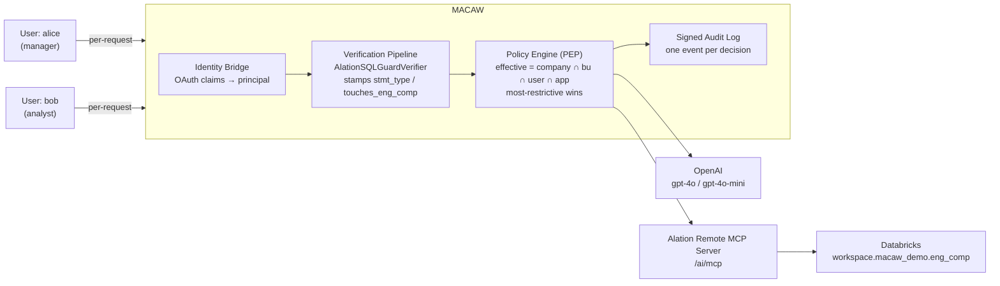

# Securing Alation with MACAW , PoC Walkthrough

Governing an Alation MCP integration end-to-end with MACAW: **who may use which AI model**, **how
many tokens they may request**, **what SQL they may run against catalogued data**, and **which
actions require a human approval** , all decided per request, against the caller's identity, and
recorded in a signed audit log.


---

## 0. Overview

### What this shows

alice is a manager, bob is an analyst. Both log in through Auth0. Each makes 3 LLM calls and
2 Alation SQL calls. The code is the same for both; only their policies differ.

| What is controlled | Where it is set |
|---|---|
| Which LLM a user may call | `model.allowed_values` on `tool:openai-service/generate` |
| How many tokens they may ask for | `max_tokens.max` on the same tool |
| Which SQL statements are allowed | verifier stamps `stmt_type`, policy allow-lists it |
| Access to the `eng_comp` table | verifier stamps `touches_eng_comp`, policy asks for an attestation |
| Who can approve | `approval_criteria: role:manager` |
| Record of what happened | signed audit event per decision, in the MACAW Console |

### Architecture




---

## 1. Setup

### a. SDK and virtual environment

```
macaw-client-0.9.9.6-Linux-x86_64-py3.12/
├── macaw_client-0.9.9.6-cp312-cp312-manylinux_2_17_x86_64.whl   ← client library
├── .macaw/config.json          ← endpoint + API key, already filled in
├── keys/
├── secureAI/
│   ├── macaw_adapters/         ← OpenAI, Anthropic, LangChain, LiteLLM, MCP
│   ├── examples/               ← 41 examples
│   └── test_harness_quick.py   ← checks the install
└── README.md
```

```bash
python -m venv .venv && source .venv/bin/activate
export MACAW_HOME=/path/to/macaw-client-0.9.9.6-Linux-x86_64-py3.12
pip install "$MACAW_HOME"/macaw_client-*.whl "$MACAW_HOME/secureAI[all]"
python "$MACAW_HOME/secureAI/test_harness_quick.py"
```

### b. Environment

```bash
export MACAW_HOME="<path to the macaw-client-* directory>"
export ALATION_BASE_URL="https://<tenant>.alationcloud.com"
export ALATION_CLIENT_ID="<oauth client id>"
export ALATION_CLIENT_SECRET="<oauth client secret>"
export ALATION_MCP_URL="https://<tenant>.alationcloud.com/ai/mcp/<uuid>"
export OPENAI_API_KEY="<key>"
```

Use straight quotes. A curly quote copied from a document becomes part of the value and the key
will be rejected.

### c. Alation token

```bash
python utility/get_alation_user_token.py     # opens a browser, does OAuth + PKCE
```

It prints two things: an **access token** and a **refresh token**.

```bash
export ALATION_TOKEN="<the access token>"
```

The access token lasts 72 hours. Keep the refresh token, and use it to get a new access token
without going through the browser again:

```bash
python utility/get_alation_user_token.py --refresh <REFRESH_TOKEN>
```

---

## 2. Identity provider

MACAW does not do its own logins. It reads the claims from your IdP and maps them to policy.

**Case A — use the Auth0 tenant that is already set up:**

```yaml
name:           alation-MACAW
domain:         dev-5ntnefdmlsiwh7nv.us.auth0.com
client_id:      0C1R7rIwNCmpw4ZLgtKKG7rAmbU0hird
client_secret:  <paste the Auth0 application client secret>
api_audience:   https://alation-macaw

mappings:
  subject_path:        sub
  email_path:          email
  name_path:           https://macaw.local/username
  organization_path:   https://macaw.local/organization
  roles_path:          https://macaw.local/roles
  team_path:           https://macaw.local/team
  business_unit_path:  https://macaw.local/business_unit
```

**Case B — your own IdP:** Console → *Tutorials → Make it Real → Connect Identity Provider*.

### The two users

Both are in the Auth0 tenant above. `script.py` logs in as each one; the password is in the script.

| Login | username | roles | business_unit | team |
|---|---|---|---|---|
| `alice.alation@gmail.com` | `alice` | `["manager"]` | `analytics` | `analytics` |
| `bob.alation@gmail.com` | `bob` | `["analyst"]` | `analytics` | `analytics` |

alice has the `manager` role, which is what lets her approve bob's attestation.

### What the claims are used for

Each claim becomes the name of a policy to look up:

| Claim | Value | Policy |
|---|---|---|
| `name_path` → username | `alice` | `user:alice` |
| `business_unit_path` | `analytics` | `bu:analytics` |
| `organization_path` | `alation-MACAW` | `company:alation-MACAW` |
| `roles_path` | `["manager"]` | matches `approval_criteria: role:manager` |


---

## 3. Policies

Five files. Four form the caller hierarchy, one covers the server.

```
▼ company:alation-MACAW              v1.0.1     org-wide baseline
    └─ ▼ bu:analytics                v0.1.1     business unit
        ├─ user:alice                           manager
        └─ user:bob                             analyst

▼ app:alation-remote-proxy           v0.8.0     applies to everyone
```

Load each one: **Policies → Add Policy → Code Editor → paste JSON → Validate → Save.**

1. `Policies/company.json`
2. `Policies/bu.json`
3. `Policies/User/alice.json`
4. `Policies/User/bob.json`
5. `Policies/app.json`

### How they combine

```
effective policy = company ∩ bu ∩ user ∩ app     (the strictest value wins)
```

A child can only narrow what its parent allows. Allow-lists are intersected, `max` takes the lower
number, denials add up. So a user cannot give themselves more than their BU or company allows, and
the app policy caps everyone regardless.

### What each user gets

| | alice (manager) | bob (analyst) |
|---|---|---|
| OpenAI models | `gpt-4o-mini`, `gpt-4o` | `gpt-4o-mini` |
| `max_tokens` | 2000 | 100 |
| SQL statements | `select`, `update` | `select`, `update` |
| Needs an attestation when | `touches_eng_comp` **and** `stmt_type == 'update'` | `touches_eng_comp` (any statement) |
| Approved by | `role:manager` | `role:manager` |

Both attestations are `one_time: true` with `time_to_live: 300` seconds.

`app:alation-remote-proxy` applies to everyone: it exposes four Alation tools, allows only
`stmt_type` of `select` or `update` on the three SQL tools, and lists destructive SQL patterns
(`*DELETE *`, `*DROP *`, `*TRUNCATE*`, `*ALTER *`, `*MERGE *`, `*GRANT *`, …) under
`denied_parameters` as a second check that does not depend on the verifier.

---

## 4. The custom verifier

Custom verifiers run inside the verification pipeline before the policy decision, compute facts
about the request, and stamp them onto the parameters so MAPL can gate on them.

`utility/alation_verifier.py` — `AlationSQLGuardVerifier`, attached at priority 20:

```python
proxy.macaw_client.agent.verification_pipeline.add_verifier(AlationSQLGuardVerifier(), priority=20)
```

It parses the SQL with sqlglot (dialect `databricks`) and stamps three parameters:

| Parameter | Values | Comes from |
|---|---|---|
| `stmt_type` | `select`, `update`, `insert`, `delete`, `merge`, `create`, `drop`, `truncate`, `other`, `nl_only`, `denied` | the AST root node |
| `touches_salary` | `true` / `false` | any identifier containing `salary` (`SENSITIVE_TOKENS`) |
| `touches_eng_comp` | `true` / `false` | any table in `SENSITIVE_TABLES = ("eng_comp",)` |

How it decides:

| What it does | Why |
|---|---|
| Looks at what the statement really is, not the words in it | `INSERT … SELECT` has the word SELECT in it, but it writes |
| Only the types it recognises get through | anything else is marked `other`, and no policy allows `other` |
| If it cannot read the SQL, it says no | empty, two statements at once, or unparseable → `denied` |
| A SQL tool called with no SQL is refused | otherwise Alation writes the SQL itself, where we cannot see it |
| Matches the table name however it is written | `workspace.macaw_demo.eng_comp` matches, `eng_comp_archive` does not |
| Checks every SQL field and keeps the worst answer | a safe `sql` cannot hide a dangerous `query` |

### The verifier only stamps. The policy decides.

**DELETE is refused.** The verifier stamps `stmt_type`. `Policies/User/bob.json` allows two values:

```json
"stmt_type": { "type": "string", "allowed_values": ["select", "update"] }
```

```
bob: DELETE FROM …eng_comp   ->  stamped stmt_type="delete"
                             ->  not in ["select","update"]
                             ->  Parameter 'stmt_type'=delete not in allowed values: ['select', 'update']
```

**Touching eng_comp needs a manager.** The verifier stamps `touches_eng_comp`. The trigger in
`Policies/User/bob.json` fires on it, and the config says who can clear it:

```json
"attestations": [ "eng_comp_attestation::{ params.touches_eng_comp == 'true' }" ]

"eng_comp_attestation": { "approval_criteria": "role:manager", "one_time": true, "time_to_live": 300 }
```

```
bob: SELECT name, base_salary FROM …eng_comp  ->  stamped touches_eng_comp="true"
                                             ->  condition true, attestation required
                                             ->  Missing or invalid attestation: eng_comp_attestation
                                             ->  runs after a role:manager approves it
```

alice has a narrower trigger on the same table, so her writes need approval but her reads do not:

```json
"attestations": [ "eng_comp_update_attestation::{ params.touches_eng_comp == 'true' AND params.stmt_type == 'update' }" ]
```

That is why the same SELECT runs for alice and stops for bob.
---

## 5. Run it

```bash
export MACAW_HOME="<path to macaw-client-0.9.9.6-Linux-x86_64-py3.12>"
export ALATION_MCP_URL="https://<tenant>.alationcloud.com/ai/mcp/<uuid>"
export ALATION_TOKEN="<fresh 72h bearer>"    # from utility/get_alation_user_token.py
export OPENAI_API_KEY="<key>"

python script.py
```

For each user the script logs in, registers a `MACAWClient`, binds the Alation proxy to that user,
then makes 3 LLM calls and 2 SQL calls.

- LLM calls go from the user to the shared SecureOpenAI service, as `invoke_tool` on
  `tool:openai-service/generate`.
- SQL calls go through `bound.call_tool("run_query_sql_custom_adi", …)`, which passes the verifier
  and the policy engine before the proxy talks to Alation.

Data used: data product `databricks-macaw-product`, table `workspace.macaw_demo.eng_comp`. Use the
full name; Databricks will not resolve a bare `eng_comp`.

---

## 6. Results

From a live run.

### alice (manager)

| # | Call | Request | Result | What MACAW said |
|---|---|---|---|---|
| 1 | LLM | `gpt-4-turbo`, 80 tokens | 🔴 BLOCKED | `Parameter 'model'=gpt-4-turbo not in allowed values: ['gpt-4o-mini', 'gpt-4o']` |
| 2 | LLM | `gpt-4o`, 3000 tokens | 🔴 BLOCKED | `Parameter 'max_tokens'=3000 exceeds maximum: 2000` |
| 3 | LLM | `gpt-4o`, 500 tokens | 🟢 ALLOWED | *"Compound interest is the process where interest is added to the principal…"* |
| 4 | SQL | `SELECT name, base_salary FROM workspace.macaw_demo.eng_comp LIMIT 3` | 🟢 ALLOWED | rows returned |
| 5 | SQL | `SELECT COUNT(*) FROM workspace.macaw_demo.eng_comp` | 🟢 ALLOWED | `COUNT(*) = 4` |

### bob (analyst)

| # | Call | Request | Result | What MACAW said |
|---|---|---|---|---|
| 1 | LLM | `gpt-4o`, 80 tokens | 🔴 BLOCKED | `Parameter 'model'=gpt-4o not in allowed values: ['gpt-4o-mini']` |
| 2 | LLM | `gpt-4o-mini`, 300 tokens | 🔴 BLOCKED | `Parameter 'max_tokens'=300 exceeds maximum: 100` |
| 3 | LLM | `gpt-4o-mini`, 80 tokens | 🟢 ALLOWED | *"Compound interest is the interest calculated on the initial principal…"* |
| 4 | SQL | `DELETE FROM workspace.macaw_demo.eng_comp WHERE name = 'nobody'` | 🔴 BLOCKED | `Parameter 'stmt_type'=delete not in allowed values: ['select', 'update']` |
| 5 | SQL | `SELECT name, base_salary FROM workspace.macaw_demo.eng_comp LIMIT 3` | 🟡 ATTESTATION | `Missing or invalid attestation: eng_comp_attestation` |

---

## 7. Summary

The same five calls, run by two people, produced ten different decisions. There is no `if` in the
script that does this — the rules are in the policies, and the identity comes from Auth0.

- alice and bob share the code, the services and the API keys, but get different access on every
  call.
- Model and token limits are set per user and checked before the provider is called.
- The verifier lets the policy see what the SQL actually does, so rules can name statements and
  tables instead of matching strings.
- Sensitive access waits for a named approver.
- Every decision is signed and logged with its reason.
